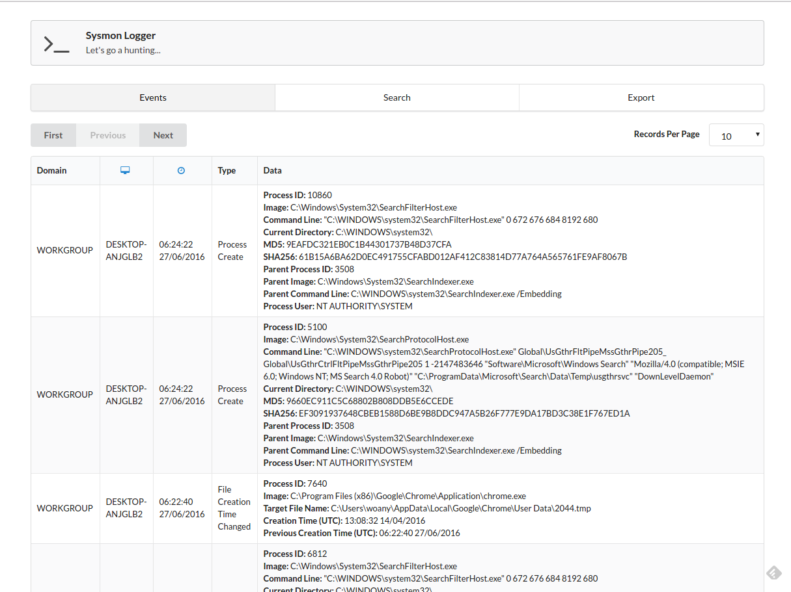

# SysMon-Logger (SML)

## Background
There are various questions that need to be answered when a network breach occurs, these questions include:

- What was the Initial Infection Vector (IIV)?
- What actions occurred?
- Did the activity spread to other systems?

Whilst the Windows Event log can provide some details, it is generally insufficent for the task. The [SysInternals Sysmon](https://technet.microsoft.com/en-gb/sysinternals/sysmon) software is a Windows system service and device driver that provides system activity logging. The Sysmon software was written by Mark Russinovich (Microsoft) and Thomas Garnier

The events that are available for monitoring with Sysmon v4 are:

- Process Creation
- Process Changed File Creation Time
- Network Connection
- Sysmon Service State Changed
- Process Terminate
- Driver Loaded
- Image Loaded
- Create Remote Thread
- Raw Access Read
- Error

There is a known issue with Sysmon v4 and Windows 10 in that the **Network Connection** events are not triggered.

SysMon-Logger is a three component system that allows organisations to have a network wide view of all of the SysMon data from their Windows hosts.

The first component is a simple Windows service that hooks into the Event log using the [Microsoft.Diagnostics.Tracing.TraceEvent](https://www.nuget.org/packages/Microsoft.Diagnostics.Tracing.TraceEvent) library. The hooking allows for just the Sysmon specific events to be extracted. The Sysmon events are buffered for 5 seconds and then sent to the second component; the analysis server. The analysis server parses the data and imports it into a database. The data is inserted into event specific tables and into a unified table that holds all of the events.

The final component in the system is the user interface (UI) server, that displays the events data.

## Implementation

The Windows service is written using the Microsoft .Net framework. The service uses the Sysmon event data and extracts the XML. The XML data is compressed using GZIP and is sent via TLS to the server.

The analysis server is written in the [Go Programming Language](https://golang.org/) (golang) and is designed to run on a Linux host. The server uses a [PostgreSQL](https://www.postgresql.org/) database to store the autorun data.

The UI server is again written using golang. The server implements its own HTTPS server so no other software is required.

## Screenshot

